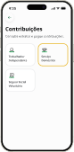
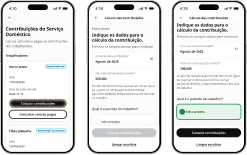
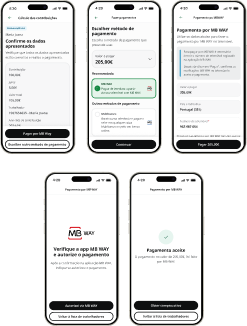

# Paulo Chiozzini — Portfolio Design System

> **Rule #1**: Never hardcode values. Always use tokens from this document.  
> **Rule #2**: Never add new tokens without first confirming the value doesn't already exist here.  
> **Source of truth**: [`style.css`](./style.css) · Synced with Figma Dev Mode MCP.

---

## Table of Contents

1. [Breakpoints & Layout](#1-breakpoints--layout)
2. [Color Tokens](#2-color-tokens)
3. [Spacing Tokens](#3-spacing-tokens)
4. [Radius Tokens](#4-radius-tokens)
5. [Typography Tokens](#5-typography-tokens)
6. [Typography Utility Classes](#6-typography-utility-classes)
7. [Button System](#7-button-system)
8. [Tag Component](#8-tag-component)
9. [Navbar & Header](#9-navbar--header)
10. [Case Study Components](#10-case-study-components)
11. [Naming Conventions](#11-naming-conventions)

---

## 1. Breakpoints & Layout

| Name | Value | Usage |
|---|---|---|
| Mobile | `< 768px` | Base styles (no media query) |
| Tablet | `≥ 768px` | `@media (min-width: 768px)` |
| Desktop | `≥ 1024px` | `@media (min-width: 1024px)` |

### Layout Tokens

| Token | Value | Description |
|---|---|---|
| `--layout-margin` | `120px` | Horizontal padding on desktop pages |
| `--layout-gutter` | `24px` | Horizontal padding on tablet pages |
| `--layout-container-width` | `1200px` | Max content width (inner containers) |
| `--layout-viewport-width` | `1440px` | Max outer wrapper width |

### Layout Pattern (Desktop)

```css
/* Full-bleed container that centers content to 1200px */
.my-wrapper {
  width: 100%;
  max-width: var(--layout-viewport-width); /* 1440px outer */
  margin: 0 auto;
  padding: 0 var(--layout-margin);         /* 120px → 1200px inner */
}
```

> **Important**: Background colors (e.g. hero yellow, dark footer) always apply to the **outer** element (`width: 100%`). The `__inner` wrapper handles centering and padding.

### Navbar Heights (scroll-padding-top)

| Breakpoint | Height |
|---|---|
| Mobile | `64px` |
| Tablet | `72px` |
| Desktop | `80px` |

---

## 2. Color Tokens

### Backgrounds & Surfaces

| Token | Value | Usage |
|---|---|---|
| `--bg-primary` | `#ffffff` | Main page background |
| `--bg-secondary` | `#f5f5f5` | Cards (gray variant), sections |
| `--bg-tertiary` | `#ebebeb` | Hover states on neutral buttons |
| `--bg-dark-secondary` | `#1e1e1e` | Dark section backgrounds |
| `--surface-dark` | `#2c2c2c` | Dark buttons, footer surfaces |

### Text

| Token | Value | Usage |
|---|---|---|
| `--text-title` | `#1e1e1e` | Headings, card titles |
| `--text-body` | `#303030` | Body copy, paragraphs |
| `--text-muted` | `#757575` | Labels, captions, meta |
| `--text-on-dark` | `#f5f5f5` | Text on dark surfaces |

### Borders

| Token | Value | Usage |
|---|---|---|
| `--border-default` | `#d9d9d9` | Card borders, dividers |
| `--border-strong` | `#2c2c2c` | Primary button border |

### Brand Colors

| Token | Value | Usage |
|---|---|---|
| `--brand-segsocial` | `#006633` | Metric card values (Seg. Social pages) |
| `--brand-segsocial-hero` | `#fbbd3d` | Hero banner background (Seg. Social) |
| `--brand-pagbank` | `#4da73f` | Metric card values (PagBank page) |
| `--brand-pagbank-hero` | `#5cbc4c` | Hero banner background (PagBank) |
| `--brand-yamaha` | `#3f55a5` | Metric values & Hero banner (Yamaha) |
| `--brand-yamaha-dark` | `#3b509b` | Hero bottom background (Yamaha) |
| `--brand-yamaha-accent` | `#0069d9` | Decorative accent (Yamaha) |

### Accents

| Token | Value | Usage |
|---|---|---|
| `--accent-green` | `#14ae5c` | Positive indicators |
| `--accent-yellow` | `#e8b931` | Focus rings, highlights |
| `--accent-red` | `#ec221f` | Error states |
| `--accent-teal` | `#005172` | Info accents |

### Alpha & Primitives
 
| Token | Value | Usage |
|---|---|---|
| `--alpha-dark-5` | `rgba(0, 0, 0, 0.05)` | Subtle button hover, tag backgrounds |
| `--alpha-dark-10` | `rgba(0, 0, 0, 0.10)` | Subtle button active / pressed |
| `--alpha-light-5` | `rgba(255, 255, 255, 0.05)` | Subtle inverted button hover (dark bg) |
| `--alpha-light-10` | `rgba(255, 255, 255, 0.10)` | Subtle inverted button active / pressed |
| `--dark-50` | `rgba(0, 0, 0, 0.05)` | Tag backgrounds, subtle hover |
| `--dark-200` | `rgba(0, 0, 0, 0.20)` | Overlay effects, dark hero pills |
| `--overlay-hover` | `rgba(0, 0, 0, 0.12)` | Hover state overlays |
| `--gray-150` | `#ebebeb` | Dividers, borders, neutral active |

### Highlight Badges

| Token | Value |
|---|---|
| `--highlight-positive` | `#cff7d3` |
| `--highlight-negative` | `#fdd3d0` |
| `--highlight-confused` | `#fff1c2` |
| `--highlight-info` | `#e6f4fa` |

---

## 3. Spacing Tokens

### Primitive Scale

| Token | Value |
|---|---|
| `--space-4` | `4px` |
| `--space-8` | `8px` |
| `--space-12` | `12px` |
| `--space-14` | `14px` |
| `--space-16` | `16px` |
| `--space-20` | `20px` |
| `--space-24` | `24px` |
| `--space-28` | `28px` |
| `--space-32` | `32px` |
| `--space-48` | `48px` |
| `--space-64` | `64px` |
| `--space-80` | `80px` |
| `--space-120` | `120px` |
| `--space-140` | `140px` |

### Semantic Aliases

| Token | Resolves to | px value |
|---|---|---|
| `--spacing-3xs` | `--space-4` | `4px` |
| `--spacing-2xs` | `--space-4` | `4px` |
| `--spacing-xs` | `--space-8` | `8px` |
| `--spacing-sm` | `--space-12` | `12px` |
| `--spacing-footer-internal` | `--space-14` | `14px` |
| `--spacing-md` | `--space-16` | `16px` |
| `--spacing-lg` | `--space-24` | `24px` |
| `--spacing-xl` | `--space-32` | `32px` |
| `--spacing-3xl` | `--space-48` | `48px` |
| `--spacing-6xl` | `--space-80` | `80px` |

> **Always use semantic aliases** (`--spacing-lg`), not primitives (`--space-24`), unless the primitive has no alias.

---

## 4. Radius Tokens

| Token | Value | Common usage |
|---|---|---|
| `--radius-xs` | `4px` | — |
| `--radius-sm` | `8px` | — |
| `--radius-md` | `8px` | Buttons, back button |
| `--radius-base` | `12px` | Images, mockups |
| `--radius-lg` | `16px` | Cards (content, metric, gray) |
| `--radius-xl` | `100px` | Tags/pills |
| `--radius-pill` | `200px` | Full pill shapes |

---

## 5. Typography Tokens

### Font Family

```
--font-family-default: 'Inter', -apple-system, BlinkMacSystemFont, 'Segoe UI', Roboto, Helvetica, Arial, sans-serif;
```

### Font Weights

| Token | Value |
|---|---|
| `--font-weight-regular` | `400` |
| `--font-weight-medium` | `500` |
| `--font-weight-semibold` | `600` |
| `--font-weight-bold` | `700` |

### Font Sizes

| Token | Value |
|---|---|
| `--font-size-xs` | `12px` |
| `--font-size-s` | `14px` |
| `--font-size-m` | `16px` |
| `--font-size-base` | `18px` |
| `--font-size-l` | `20px` |
| `--font-size-h4` | `24px` |
| `--font-size-h3` | `32px` |
| `--font-size-h2` | `48px` |
| `--font-size-h1` | `72px` |

### Line Heights

| Token | Value |
|---|---|
| `--line-height-xs` | `18px` |
| `--line-height-s` | `21px` |
| `--line-height-m` | `24px` |
| `--line-height-base` | `27px` |
| `--line-height-l` | `30px` |
| `--line-height-h4` | `29px` |
| `--line-height-h3` | `38px` |
| `--line-height-h2` | `58px` |
| `--line-height-h1` | `86px` |

### Font Size / Line Height Pairs (Quick Reference)

| Style | font-size | line-height | weight |
|---|---|---|---|
| H1 | `72px` | `86px` | Bold 700 |
| H2 | `48px` | `58px` | Bold 700 |
| H3 | `32px` | `38px` | Medium 500 |
| H4 | `24px` | `29px` | SemiBold 600 |
| Body LG | `20px` | `30px` | Regular 400 |
| Body Base | `18px` | `27px` | SemiBold 600 (label) / Regular 400 (body) |
| Body M | `16px` | `24px` | Regular 400 |
| Label SM | `14px` | `21px` | Medium 500 |
| Caption | `12px` | `18px` | Regular 400 |

---

## 6. Typography Utility Classes

| Class | font-size | line-height | weight | color |
|---|---|---|---|---|
| `h1`, `.heading-h1` | `--font-size-h1` | `--line-height-h1` | 700 | `--text-title` |
| `h2`, `.heading-h2` | `--font-size-h2` | `--line-height-h2` | 700 | `--text-title` |
| `h3`, `.heading-h3` | `--font-size-h3` | `--line-height-h3` | 500 | `--text-title` |
| `h4`, `.heading-h4` | `--font-size-h4` | `--line-height-h4` | 600 | `--text-title` |
| `.heading-h5-bold` | `--font-size-l` | `--line-height-m` | 700 | `--text-title` |
| `.heading-h6` | `--font-size-base` | `--line-height-base` | 600 | `--text-title` |
| `p`, `.body-base` | `--font-size-m` | `--line-height-m` | 400 | `--text-body` |
| `.body-sm` | `--font-size-s` | `--line-height-s` | 400 | `--text-muted` |
| `.body-lg` | `--font-size-l` | `--line-height-l` | 400 | `--text-body` |
| `.label-base` | `--font-size-m` | `--line-height-m` | 500 | (inherits) |
| `.label-sm` | `--font-size-s` | `--line-height-s` | 500 | (inherits) |
| `.label-sm-semibold` | `--font-size-s` | `--line-height-s` | 600 | (inherits) |
| `.label-lg-semibold` | `--font-size-base` | `--line-height-base` | 600 | (inherits) |

---

## 7. Button System

All buttons combine `.btn` (base) + one **variant** + (optionally) one **size modifier**.

### Variants & Interactive States

| Class | Default | Hover | Pressed / Active | Focused | Usage |
|---|---|---|---|---|---|
| `.btn--primary` | `--surface-dark` bg, `--border-strong` border, `--text-on-dark` | `opacity: 0.85` | `opacity: 0.70` | `2px` `--accent-yellow` ring | Main CTA |
| `.btn--neutral` | `--bg-primary` bg, `--border-default` border, `--text-title` | `--bg-secondary` (`#f5f5f5`) | `--bg-tertiary` (`#ebebeb`) | `2px` `--accent-yellow` ring | Secondary action |
| `.btn--subtle` | transparent bg & border, `--text-body` (`#303030`) | `--alpha-dark-5` (`rgba(0,0,0,0.05)`) | `--alpha-dark-10` (`rgba(0,0,0,0.10)`) | `2px` `--accent-yellow` ring | Ghost / tertiary |
| `.btn--subtle-inverted` | transparent bg & border, `--text-on-dark` (`#f5f5f5`) | `--alpha-light-5` (`rgba(255,255,255,0.05)`) | `--alpha-light-10` (`rgba(255,255,255,0.10)`) | `2px` `--accent-yellow` ring | Ghost on dark bg |
| `.btn--jump` | `--surface-dark` bg, `--text-on-dark` | `opacity: 0.85` | `opacity: 0.70` | `--accent-yellow` ring | Jump to section CTA |
| `.btn--jump-inverted` | `--bg-primary` bg, `--text-body` | `--bg-secondary` | `--bg-tertiary` | `--accent-yellow` ring | Inverted jump CTA |

> **Icon buttons**: Buttons containing an icon element (`<i class="ph ..."></i>`) automatically apply `gap: var(--spacing-xs)` (8px) and align icon and label smoothly.

> **`.btn--jump`** has `border-radius: 0 0 var(--radius-md) var(--radius-md)` — it attaches visually to the hero banner bottom edge.

### Size Modifiers

| Class | Padding | Font size / Line height | Icon Size |
|---|---|---|---|
| `.btn--md` (default) | `--spacing-sm` (12px) | `--font-size-m` (16px / 24px) | `16px` |
| `.btn--sm` | `--spacing-xs` `--spacing-md` (8px 16px) | `--font-size-s` (14px / 21px) | `16px` |
| `.btn--full` | `--spacing-sm` (12px), width: 100%, height: 48px | `--font-size-m` (16px / 24px) | `16px` |

---

## 8. Tag Component

```html
<span class="project-tag">Public Sector</span>
```

| Property | Value |
|---|---|
| Background | `--dark-50` (`rgba(0,0,0,0.05)`) |
| Border radius | `--radius-xl` (`100px`) |
| Padding | `--space-4` `--spacing-md` |
| Font size | `--font-size-s` (`14px`) |
| Font weight | `--font-weight-medium` (`500`) |
| Color | `--text-title` |

---

## 9. Navbar & Header

The `<portfolio-header>` Web Component auto-detects sub-pages and prefixes nav links with `index.html#` accordingly.

```html
<header id="main-header">
  <portfolio-header></portfolio-header>
</header>
```

| Breakpoint | Height | H-Padding |
|---|---|---|
| Mobile | `64px` | `--spacing-md` (16px) |
| Tablet | `72px` | `--spacing-lg` (24px) |
| Desktop | `80px` | `--layout-margin` (120px) |

---

## 10. Case Study Components

Used in project pages (`project-*.html`).

### Page Wrapper

```html
<main class="project-content">
  <section class="case-section" id="overview">...</section>
  <section class="case-section" id="solution">...</section>
</main>
```

| Class | Max-width | Gap | Padding |
|---|---|---|---|
| `.project-content` | `1440px` (8 col: `792px` in desktop layout) | `--spacing-6xl` | `0 16px/24px/120px` (mobile/tablet/desktop) |
| `.case-section` | `792px` (8 col) | `--spacing-xl` | — |

### Section Typography

| Class | Style | Scales to |
|---|---|---|
| `.case-section__heading` | H2 Bold | `34px` → `40px` → `48px` |
| `.case-section__subheading` | H3 Regular | `28px` → `30px` → `32px` |
| `.case-section__body` | Body Regular | `--font-size-m` (16px, all breakpoints) |

### Hero (Project Pages)

| Class | Description |
|---|---|
| `.project-hero__banner` | Full-width colored band |
| `.project-hero__banner-inner` | Centering + padding inner wrapper |
| `.project-hero__back` | "← Back to home" link |
| `.project-hero__container` | Text content block (`max-width: 1200px`) |
| `.project-hero__main-title` | H1 Bold (`34px` → `40px` → `48px`) |
| `.project-hero__subtitle-title` | Sub-title Regular (`28px` → `30px` → `32px`) |
| `.project-hero__tagline` | One-liner (Regular, `--font-size-m`) |
| `.project-hero__meta` | Timeline / Team / Role row |
| `.project-hero__meta-label` | Label SemiBold 14px |
| `.project-hero__meta-value` | Value SemiBold (scales per breakpoint) |
| `.project-hero__tags` | Flex-wrap `.project-tag` container |
| `.project-hero__background` | White area below hero banner |
| `.project-hero__background-inner` | Inner centering wrapper |
| `.project-hero__jump-btn` | Jump CTA (full-width mobile, auto on tablet+) |
| `.project-hero__mockup-img` | App mockup — `width: 100%`, `--radius-base` |

### Content Cards

| Class | Background | Border | Padding | Radius |
|---|---|---|---|---|
| `.content-card--gray` | `--bg-secondary` | none | `--spacing-lg` | `--radius-lg` |
| `.content-card--white` | `--bg-primary` | `1px solid --border-default` | `--spacing-lg` | `--radius-lg` |

| Class | Size | Weight | Color |
|---|---|---|---|
| `.content-card__title` | `--font-size-base` (18px) | 600 | `--text-title` |
| `.content-card__desc` | `--font-size-m` (16px) | 400 | `--text-body` |

### Metric Cards

```html
<div class="metrics-grid">
  <div class="metric-card">
    <span class="metric-card__value">13,900+</span>
    <span class="metric-card__label">Payments in 60 Days</span>
    <p class="metric-card__desc">...</p>
  </div>
</div>
```

| Class | Layout | Notes |
|---|---|---|
| `.metrics-grid` | Column (mobile/tablet) → Row (desktop) | 3-up grid on `≥ 1024px` |
| `.metric-card__value` | H3 size, `--brand-segsocial` color | Project-specific brand color |
| `.metric-card__label` | SemiBold 18px | `--text-body` |
| `.metric-card__desc` | Regular 16px | `--text-body` |

### Social Proof Article

| Class | Description |
|---|---|
| `.case-article` | Flex-col, gap `--spacing-xl` |
| `.case-article__media` | Image wrapper, left-aligned |
| `.case-article__img` | `max-width: 725px`, `--radius-base`, `height: auto` |

### User Flow & Lightbox Modal

```html
<section class="case-section case-section--full" id="user-flow">
  <div class="user-flow">
    <h2 class="case-section__heading">User Flow...</h2>
    <div class="user-flow__legend">...</div>
    <div class="user-flow__diagram-wrapper">
      <button type="button" class="user-flow__trigger" data-modal-target="flow-modal">
        ...
        <span class="user-flow__zoom-badge"><i class="ph ph-magnifying-glass-plus"></i>Click to zoom</span>
      </button>
    </div>
  </div>
</section>

<dialog id="flow-modal" class="image-modal">
  <div class="image-modal__backdrop" data-modal-close></div>
  <div class="image-modal__container">
    <div class="image-modal__header">...</div>
    <div class="image-modal__scrollable">...</div>
  </div>
</dialog>
```

| Class | Description |
|---|---|
| `.case-section--full` | Full-container width section (`max-width: 1200px`) for wide diagrams |
| `.user-flow__legend` | Horizontal legend container (Process + Decision shapes) |
| `.user-flow__shape--process` | Process indicator (18×14px, rounded rectangle with 1.2px stroke, no fill) |
| `.user-flow__shape--decision` | Decision indicator (outline diamond with 1.2px stroke, no fill) |
| `.user-flow__trigger` | Button trigger for lightbox modal (active on tablet/mobile `<1024px>`, disabled on desktop) |
| `.user-flow__zoom-badge` | Pill badge ("Click to zoom") visible only on tablet/mobile (`<1024px>`), hidden on desktop |
| `.image-modal` | Accessible native `<dialog>` element with backdrop blur |
| `.image-modal__scrollable` | Touch/scroll container for panning full-resolution desktop diagram |

### Main Screens Showcase (3 Responsive Groups with Retina Support)

```html
<section class="case-section case-section--full" id="main-screens">
  <div class="case-section__intro">
    <h2 class="case-section__heading">Main screens</h2>
  </div>
  <div class="main-screens-showcase">
    <!-- Group 1: 1. Start from menu -->
    <div class="main-screens-group">
      <h3 class="main-screens-group__title">1. Start from menu</h3>
      <div class="main-screens-group__media">
        <button type="button" class="user-flow__trigger" aria-label="Click to zoom: 1. Start from menu mockup" data-modal-target="modal-start-menu">
          <picture>
            <source media="(min-width: 1024px)" srcset="assets/segsocial-contributions-payment-1-mockups-desktop.png 1x, assets/segsocial-contributions-payment-1-mockups-desktop@2x.png 2x">
            <source media="(min-width: 768px)" srcset="assets/segsocial-contributions-payment-1-mockups-tablet.png 1x, assets/segsocial-contributions-payment-1-mockups-tablet@2x.png 2x">
            
          </picture>
        </button>
      </div>
    </div>
    <!-- Group 2: 2. Contribution generation -->
    <div class="main-screens-group">
      <h3 class="main-screens-group__title">2. Contribution generation</h3>
      <div class="main-screens-group__media">
        <button type="button" class="user-flow__trigger" aria-label="Click to zoom: 2. Contribution generation mockup" data-modal-target="modal-worker-data">
          <picture>
            <source media="(min-width: 1024px)" srcset="assets/segsocial-contributions-worker-2-mockups-desktop.png 1x, assets/segsocial-contributions-worker-2-mockups-desktop@2x.png 2x">
            <source media="(min-width: 768px)" srcset="assets/segsocial-contributions-worker-2-mockups-tablet.png 1x, assets/segsocial-contributions-worker-2-mockups-tablet@2x.png 2x">
            
          </picture>
        </button>
      </div>
    </div>
    <!-- Group 3: 3. Payment via MB WAY -->
    <div class="main-screens-group">
      <h3 class="main-screens-group__title">3. Payment via MB WAY</h3>
      <div class="main-screens-group__media">
        <button type="button" class="user-flow__trigger" aria-label="Click to zoom: 3. Payment via MB WAY mockup" data-modal-target="modal-payment-flow">
          <picture>
            <source media="(min-width: 1024px)" srcset="assets/segsocial-contributions-payment-3-mockups-desktop.png 1x, assets/segsocial-contributions-payment-3-mockups-desktop@2x.png 2x">
            <source media="(min-width: 768px)" srcset="assets/segsocial-contributions-payment-3-mockups-tablet.png 1x, assets/segsocial-contributions-payment-3-mockups-tablet@2x.png 2x">
            
          </picture>
        </button>
      </div>
    </div>
  </div>
</section>
```

| Class | Description |
|---|---|
| `.main-screens-showcase` | Bordered white container (`border: 1px solid --border-default`, `--radius-lg`, padding `--spacing-3xl`) |
| `.main-screens-group` | Vertical group centered (`gap: var(--spacing-xl)`) |
| `.main-screens-group__title` | Group subtitle (SemiBold 600) |
| `.main-screens-group__media` | Centered media container |
| `.main-screens-group__img` | Responsive mockup image (`width: 100%`, `height: auto`, `object-fit: contain`) |

### Other Projects Web Component

```html
<!-- Automatically excludes the current project and renders the remaining 3 -->
<other-projects current="segsocial-domestic-employer"></other-projects>
```

| Class | Description |
|---|---|
| `.other-projects` | Full-bleed section (`bg: --bg-secondary`) |
| `.other-projects__inner` | Centered layout container (`max-width: 1440px`, padded per breakpoint) |
| `.other-projects__title` | Section title (H4 bold, `--text-title`) |
| `.other-projects__grid` | Responsive 3-column grid on desktop/tablet, stacked 1-column on mobile |
| `.related-project-card` | Project card with hover overlay (`--overlay-hover`) and zoom transition (`scale(1.03)`) |

### Grid helpers

| Class | Description |
|---|---|
| `.content-cards-grid` | Vertical stack of `.content-card` elements, gap `--spacing-md` |
| `.content-cards-grid--two-col` | 2-column grid on desktop/tablet (gap `--spacing-lg`), stacked 1-column on mobile |
| `.content-card--with-icon` | Content card with leading icon (`gap: var(--spacing-md)`) |
| `.research-table` | Pill-styled table for usability testing sessions (`Participants`, `Profile`, `Sessions`) |
| `.findings-container` | White bordered box with key findings list |
| `.finding-item` | Finding item with `--highlight-negative`, `--highlight-info`, or `--highlight-positive` |
| `.quotes-container` | White bordered box with user quotes list |
| `.quote-item` | Quote card with `--highlight-positive` background and icon |
| `.before-after-box` | Gray box containing UX writing before/after comparative pills |
| `.learnings-card` | Learnings card with `--highlight-positive` (What worked well) or `--highlight-confused` (What I would do differently) |
| `.showcase-grid-two` | 2-column mockup grid for desktop screens side-by-side |

---

## 11. Naming Conventions

### BEM

```
.block {}
.block__element {}
.block--modifier {}
```

### Asset naming

```
assets/[descriptor]-[client]-[breakpoint].png
assets/[descriptor]-[client]-[breakpoint]@2x.png
assets/banner-ss-domestic-employer-desktop.png
assets/segsocial-notifications-platform-mockup-Desktop.png
```

### Related Projects Thumbnails (2 Sizes + Retina 2x)

Para os cards de projetos relacionados (`<other-projects>`), são utilizados 2 tamanhos:
- **Desktop (`≥1024px`)**: `384×224` (1x: `thumbnail-[project].png`, 2x: `thumbnail-[project]@2x.png`)
- **Tablet & Mobile (`<1024px`)**: `224×131` (1x: `thumbnail-[project]-1.png`, 2x: `thumbnail-[project]@2x-1.png`)

```html
<picture class="related-project-card__picture">
  <source
    media="(min-width: 1024px)"
    srcset="assets/thumbnail-[project].png 1x, assets/thumbnail-[project]@2x.png 2x"
  >
  
</picture>
```

---

## 12. Summary Panel Component (Figma node: `614:10710`)

O `<summary-panel>` é um Web Component dinâmico e flutuante que gera automaticamente um índice navegável da página com base nos títulos `<h2>` presentes em `<main id="main-content">`.

```html
<div class="project-layout">
  <summary-panel></summary-panel>
  <main id="main-content" class="project-content">
    <!-- Seções com <h2> (8 colunas: 792px) -->
  </main>
</div>
```

### Comportamento & Responsividade
- **Desktop (`≥ 1200px`)**: Painel lateral fixo à **esquerda** (`278px`, 3 colunas, `position: sticky; top: calc(80px + var(--spacing-lg))`) e conteúdo principal à **direita** (`792px`, 8 colunas), encerrando o sticky antes do "Check my other projects" / rodapé.
- **Tablet e Mobile (`< 1200px`)**: O painel lateral fica oculto e entra em ação o **FAB (Floating Action Button)** fixo no canto inferior direito (`bottom: 24px; right: 24px;`).
  - **Ícone**: `<i class="ph ph-list-bullets"></i>`.
  - **Expansão**: Ao ser clicado/tocado, o menu do sumário **expande para cima** com animação suave e backdrop blur.
  - **Auto-Close**: Ao clicar em qualquer seção, a página rola suavemente até a âncora correspondente e o menu se fecha automaticamente.

### Especificações Visuais
| Elemento / Propriedade | Valor |
|---|---|
| Largura Desktop | `278px` (`var(--layout-col-3)`) |
| Background Painel / Dropup | `--bg-dark-secondary` (`#1e1e1e`) |
| Borda | `1px solid var(--border-strong)` (`#2c2c2c`) |
| Border Radius | `--radius-lg` (`16px`) |
| Padding Desktop | `--spacing-lg` (`24px`) |
| Padding Dropdown Mobile | `--spacing-md` (`16px`) |
| Sombra | Elevação L (`2px 2px 6px rgba(0,0,0,0.24), ...`) |
| Botão FAB | Pílula flutuante (`48px`, raio `200px`, `--surface-dark`, ícone `ph-list-bullets`) |
| Links | Estilo `Subtle Inverted` (`16px`/`24px`, `--text-on-dark`, hover `--alpha-light-5`, active `--alpha-light-10`) |

---

*Last updated: 2026-08-28 · Synced with Figma Dev Mode MCP*


